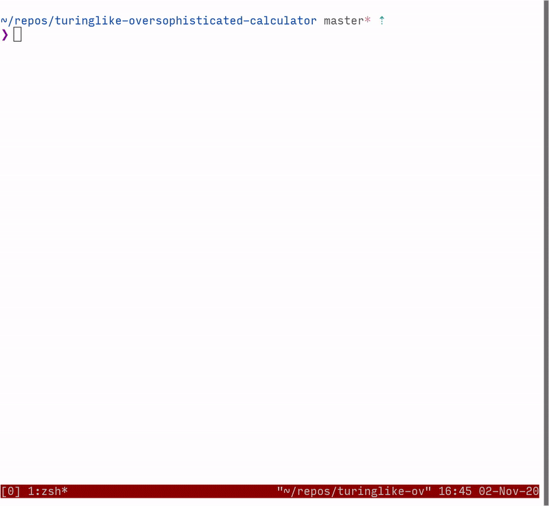

# Nondeterministic Turing Machine Interpreter

## Usage
```./interpreter <path_to_turing_machine> <steps>```

reads a word from STDIN and outputs either “YES” or “NO”,
depending whether the Turing machine specified in `<path_to_turing_machine>` has
an accepting run on this word of length of at most `<steps>`.

### Demo


## Build
- ensure you have Cargo installed
- run `make`


## Preassumptions
- We represent states of the machines as strings
- We represent the letters from the tape and input alphabet as numbers.

- In particular:
    - 0 denotes the blank symbol;
    - start ​denotes the initial state;
    - accept ​and​ reject ​denote the accepting and rejecting states.


The machine’s description is given as a list of its transitions.
Each transition is written in a separate line in the following format: (also see `example` folder)

```<current_state> <currently_seen_letter> <target_state> <letter_to_write> <direction>```

The machine accepts its input by entering the `accept` state.
The machine rejects the input word by either:
- entering the `reject` state
- getting stuck -- entering a configuration for which there is no applicable transition
- looping forever

This is a solution to a task from college - for more details also check TASK.md
